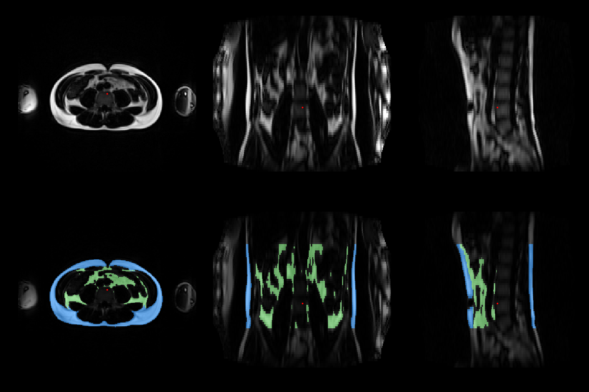

# FatSegNet : A Fully Automated Deep Learning Pipeline for Adipose Segmentation on Abdominal Dixon MRI

This repository contains the tool  designed for the [Rhineland Study](https://www.rheinland-studie.de/) 
for segmenting visceral and subcuteneous adipose tissue on fat 
images from a two-point Dixon sequence. 

If you use this tool please cite:

Estrada, Santiago, et al. "FatSegNet: A fully automated deep learning pipeline for adipose tissue segmentation on abdominal dixon MRI." Magnetic resonance in medicine 83.4 (2020): 1471-1483. [https:// doi.org/10.1002/mrm.28022](https://onlinelibrary.wiley.com/doi/full/10.1002/mrm.28022)
```
@article{estrada2020fatsegnet,
  title={FatSegNet: A fully automated deep learning pipeline for adipose tissue segmentation on abdominal dixon MRI},
  author={Estrada, Santiago and Lu, Ran and Conjeti, Sailesh and Orozco-Ruiz, Ximena and Panos-Willuhn, Joana and Breteler, Monique MB and Reuter, Martin},
  journal={Magnetic resonance in medicine},
  volume={83},
  number={4},
  pages={1471--1483},
  year={2020},
  publisher={Wiley Online Library}
}
```

## Usage
The *fatsegnet* directory contains all the source code and modules needed to run the scripts. A list of python libraries used within the 
code can be found in **requirements.txt**. In addition the input data is expected to be a nifti volume with size of [256,224,72], if the scans have a 
different size they will be crop or padd to the correct size. Additionally 
the scans have to be arrange as follows (or see [example_data_folder](./example_data_folder), **NOTE** this folder 
contain a ilustrative example of how images have to organized for FatSegNet to work.
The Fat and water images scans are empty) :  

 ```
 #Input  Scheme                            
|-- my_dataset                                                             
    participants.csv                         
    |-- Subject_1                                
        |-- FatImaging_F.nii.gz                      
        |-- FatImaging_W.nii.gz                                                                  
    |-- Subject_2                                            
        |-- FatImaging_F.nii.gz                                         
        |-- FatImaging_W.nii.gz              
    |-- Subject_3                            
        |-- FatImaging_F.nii.gz                  
        |-- FatImaging_W.nii.gz                      
    ...........                                     
    |-- Subject_xx                                    
        |-- FatImaging_F.nii.gz                      
        |-- FatImaging_W.nii.gz
 ``` 
The fat and water scans should have the same name, the name can be defined by the user,  the default names are 
**FatImaging_F.nii.gz (Fat)** and **FatImaging_W.nii.gz(water)**.

**Participants file (participants.csv)** : the purpose of this file is to configure the participants scans 
that should be process. The file has a one compulsory column  that consist of the name of folder containing 
the water and fat scans.
 
`participants.csv` example : 

```
Subject_1
Subject_2
Subject_3
Subject_xx
```

### Running the tool

The main script is called **run_fatsegnet.py**. There are a number of options which can be selected and set via the command line. 
List them by running the following command:

```
cd ./fatsegnet
python3 run_fatsegnet.py --help
```

 ####  Required Arguments
 * `--data_dir,-in_dir` : Main data directory containig the water and fat scans
 * `--output_dir,-out_dir` : Output dir for *FatSegNet* results(see output section)
 
  ####  Data specific arguments (optional) 
  * `--file,-f` : csv file containing the participants to process (default: participants.csv) 
 * `--fat_image,-fat` : Name of the fat image (default :FatImaging_F.nii.gz)
 * `--water_image,-water`: Name of the water image (default :FatImaging_W.nii.gz)

 
 ####  Model specific arguments (optional) 
 * `--run_localization,-loc` : run abdominal region localization model , by default the localization model is not run
 * `--axial,-axial` : run only axial segmentation model
 * `--order,-order` : Interpolation order (0=nearest,1=linear(default),2=quadratic,3=cubic),the tool standardizes the input resolutions to [2mm,2mm,5mm]; if the axial flag is selected only the axial plane is sample.  
 * `--control_images,-no_qc` : Flag to disable the predictions plots for quality control
 * `--cleanup,-clean` :  Flag to clean up *FatSegNet* segmentation 
 * `--batch_size,-batch`: Batch size for inference. Default: 16
 
 ####  GPU specific arguments (optional) 
 * `--gpu_id, -gpu_id` :  GPU device ID, the model will only run on the specified Gpu  (default `device ID 0`). ***Note*** the script organize the GPU IDs by pci bus IDs.
 * `--no_cuda, -no_cuda` :  Flag to disable CUDA usage in *FatSegNet* (no GPU usage, inference on CPU). ***Note*** highly recommended to run *FatSegNet* on GPU

**Examples**
```
cd ./fatsegnet
# Run paper implementation
python3 run_fatsegnet -in_dir /my/dataset/ -out_dir /my/output/dir -loc  

# Change Participants files
 
python3 run_fatsegnet -in_dir /my/dataset/ -out_dir /my/output/dir -loc -f /my/participants/file.csv

# Change name of water and fat images to search
python3 run_fatsegnet -in_dir /my/dataset/ -out_dir /my/output/dir -loc  -fat my_fat_image.nii.gz -water my_water_image.nii.gz


# Select a specific GPU (ex: device ID 2)
python3 run_fatsegnet -in_dir /my/dataset/ -out_dir /my/output/dir -loc  -gpu_id 2

# run only the segmentation models on the axial plane and define interpolation order
python3 run_fatsegnet -in_dir /my/dataset/ -out_dir /my/output/dir -axial -order 3 

# run on CPU 
python3 run_fatsegnet -in_dir /my/dataset/ -out_dir /my/output/dir -loc  -no_cuda

```

### **Output Data format**
```  bash
#Output Scheme 
|-- my_dataset_output                                   
    |-- Subject_1
        |-- MRI 
           |-- FatImaging_F.nii.gz (Fat_Scans)
           |-- FatImaging_W.nii.gz (Water_Scans)
        |-- QC
           |-- QC_[0-3].png (Quality control images)
        |-- Segmentations                                                 
           |-- AAT_pred.nii.gz (adipose tissues prediction map)
           |-- AAT_variables_summary.json  (Calculated Image Biomarkers) 
    |-- Subject_2
        |-- MRI 
           |-- FatImaging_F.nii.gz (Fat_Scans)
           |-- FatImaging_W.nii.gz (Water_Scans)
        |-- QC
           |-- QC_[0-3].png (Quality control images)
        |-- Segmentations                                                 
           |-- AAT_pred.nii.gz (adipose tissues prediction map)
           |-- AAT_variables_summary.json  (Calculated Image Biomarkers)                      
    ...............
    |-- Subject_xx
        |-- MRI 
           |-- FatImaging_F.nii.gz (Fat_Scans)
           |-- FatImaging_W.nii.gz (Water_Scans)
        |-- QC
           |-- QC_[0-3].png (Quality control images)
        |-- Segmentations    
           |-- AAT_pred.nii.gz (adipose tissues prediction map)
           |-- AAT_variables_summary.json  (Calculated Image Biomarkers)

 ``` 

**Image Biomarkers**

For more information on the pipeline image biomarkers reported in the `AAT_variables_summary.json ` file 
please check the document [FatSegNet_Variables.pdf](./FatSegNet_Variables.pdf)

**Quality Control Image Example**

By default the tool creates 4 images for visually control of the input scan and predicted segmentation, as the one shown below.
Top row fat images from axial, coronal ,sagittal view centered on the red dot; bottom row predicted segmentations 
(blue: SAT, green : VAT).    




--------
For any questions and feedback, feel free to contact santiago.estrada(at).dzne.de<br/>

--------


